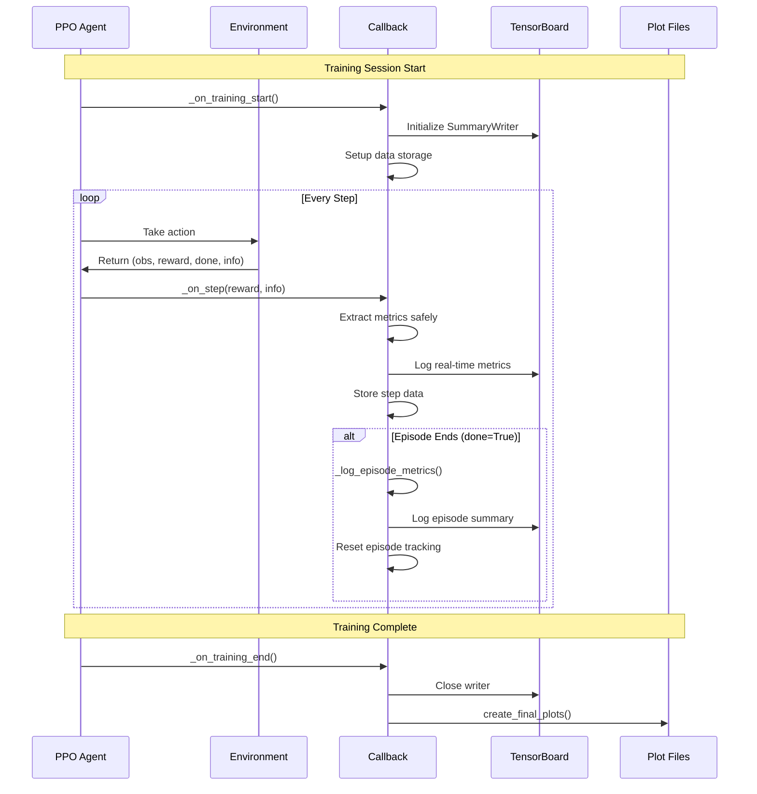
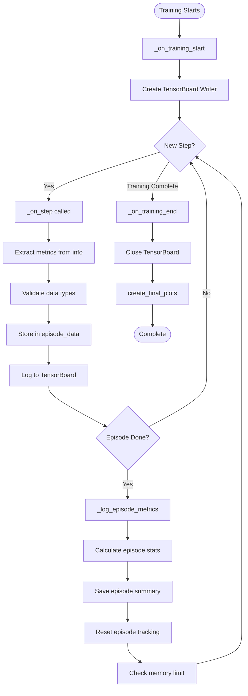
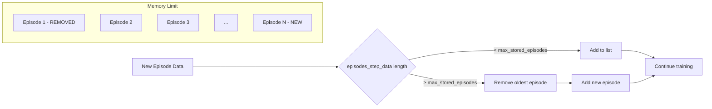
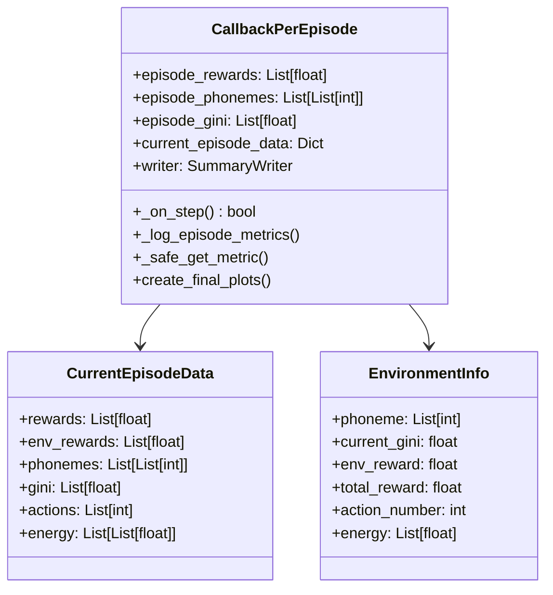
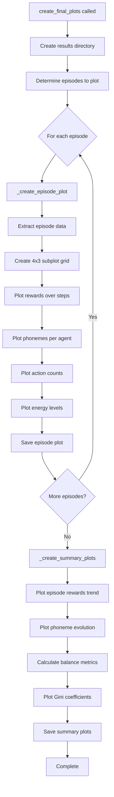
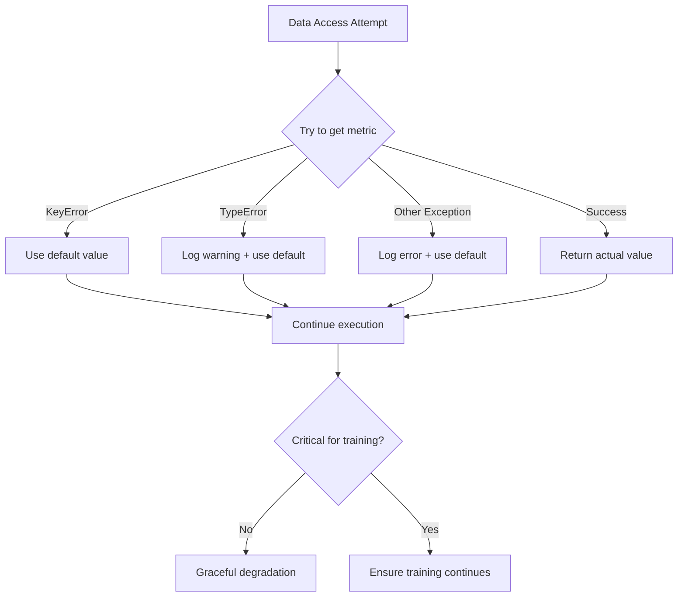
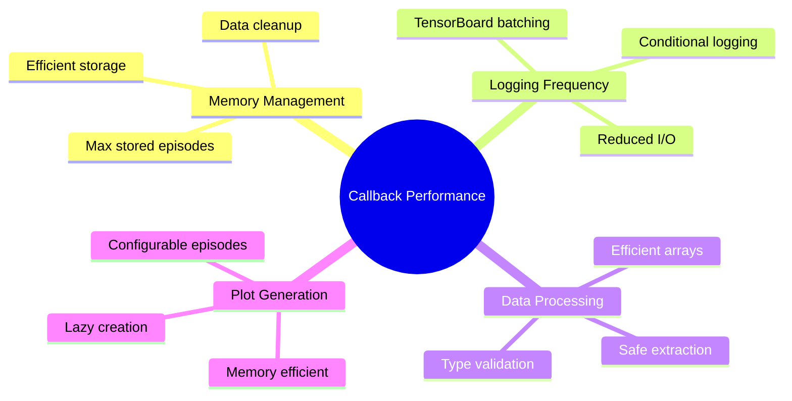
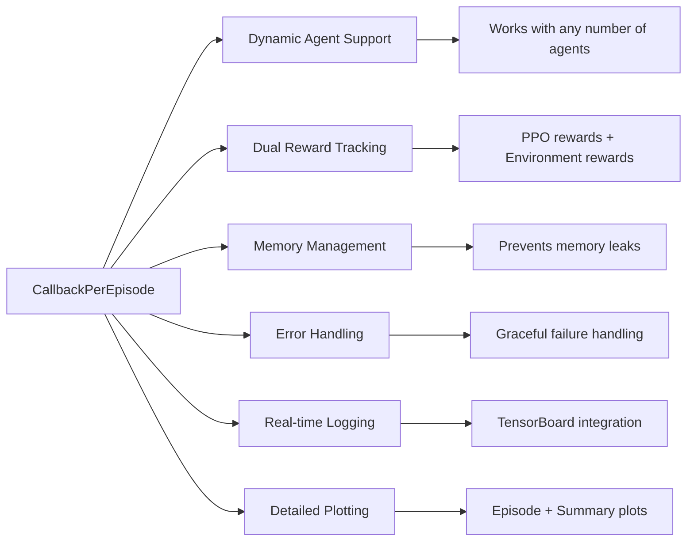

# Visual Callback Flow Diagrams

## 🔄 **Complete Training Flow with Callback**



## 📊 **Data Flow Inside Callback**

```mermaid
graph TD
    A[Environment Info Dict] --> B{Safe Extraction}
    B --> C[phoneme: [2,5,1]]
    B --> D[reward: 0.85]
    B --> E[gini: 0.23]
    B --> F[action: 3]
    B --> G[energy: [0.8,0.3,0.9]]
    
    C --> H[Current Episode Data]
    D --> H
    E --> H
    F --> H
    G --> H
    
    H --> I[TensorBoard Logging]
    H --> J[Episode Summary Storage]
    
    I --> K[Real-time Graphs]
    J --> L[Final Plots]
```

## 🎯 **Step-by-Step Callback Execution**



## 🧠 **Memory Management Strategy**



## 📈 **Data Types and Structure**



## 🎨 **Plot Generation Process**



## 🔍 **Error Handling Flow**



## 🚀 **Performance Optimization Points**



## 🎯 **Key Callback Features**



These diagrams show exactly how your callback works at every level - from the high-level training flow down to the specific data structures and error handling mechanisms!